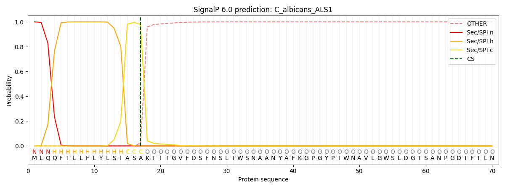
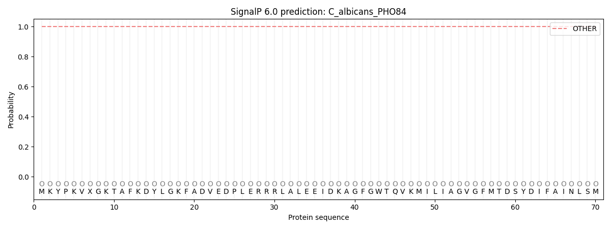
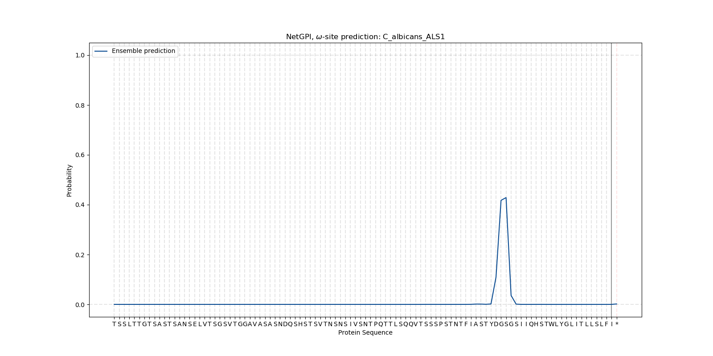
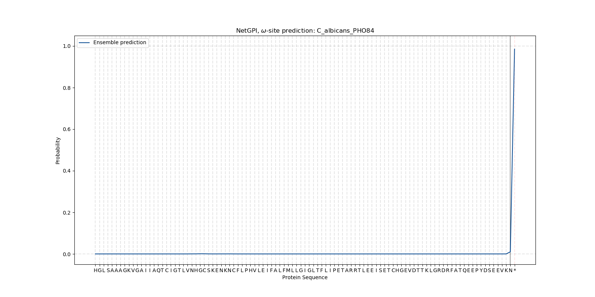

# Backup SignalP and NetGPI results

Use this page only when your instructor directs you to it or when a live
prediction server is unavailable. These results were generated on 2026-08-11
from the same *Candida albicans* ALS1 and PHO84 sequences embedded in the
morning notebook.

## SignalP 6.0

Settings: **Eukarya**, **Fast** mode, graphical output.

| Protein | Prediction | Other probability | Sec/SPI probability | Cleavage site |
| --- | --- | ---: | ---: | --- |
| ALS1 | Signal peptide (Sec/SPI) | 0.000236 | 0.999763 | Between residues 17 and 18; probability 0.9777 |
| PHO84 | Other | 0.999968 | 0.000030 | None reported |

Record the same fields requested in the notebook, then discuss what an “Other”
call means and why a predicted signal peptide does not prove that a protein is
an adhesin.

## NetGPI 1.1

Settings: graphical long output. NetGPI examines the C-terminal region and is
intended for proteins with prior evidence that they enter the secretory pathway.

| Protein | Prediction | Predicted omega site | Reported likelihood |
| --- | --- | --- | ---: |
| ALS1 | GPI-anchored | Serine at position 1239 | 0.429 |
| PHO84 | Not GPI-anchored | None; the sentinel `*` was selected | 0.985 |

The reported likelihood describes the selected prediction. For PHO84, it is the
likelihood assigned to the non-GPI sentinel rather than an omega-site score.
Interpret PHO84 only after considering its SignalP result and transporter
architecture. A positive GPI-anchor prediction would support cell-surface
localization, but would not by itself establish adhesion.
